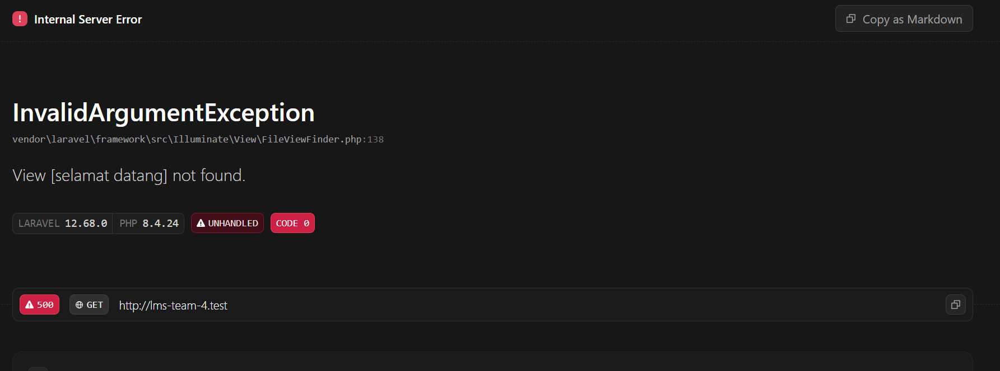

# Catatan Minggu 1
Nama : Fitriyansyah Wicaksonoaji\
Nim : 10241033\
Kelas : A

## 1.3 Read → Break → Fix → Build

### READ — Bedah instalasi Anda sendiri (45 menit)
1. Buka `public/index.php`. Baca dari atas ke bawah. Tulis dalam 3 kalimat apa yang dilakukan berkas ini.
2. Buka `bootstrap/app.php`. Identifikasi bagian mana yang mengurus route, mana yang mengurus middleware, mana yang mengurus exception.
3. Buka `routes/web.php`. Temukan route yang menghasilkan halaman selamat datang. Ubah teksnya, muat ulang browser, pastikan berubah.
4. Jalankan `php artisan route:list`. Cocokkan keluarannya dengan isi `routes/web.php`.

jawaban:

1. Yang dilakukan berkas `public/index.php` itu berfungsi sebagai entry point untuk semua permintaan atau request dari browser ke dalam aplikasi web. Jadi index.php adalah front controller. Ia juga berfungsi menginisialisasi env aplikasi dengan memuat file autoloader dari composer.

2. Di `bootstrap/app.php` ada 3 fungsi:
    - yang ngurus route:
    ```php
    ->withRouting(
        web: __DIR__.'/../routes/web.php',
        commands: __DIR__.'/../routes/console.php',
        health: '/up',
    )
    ```
    - yang ngurus middleware
    ```php
    ->withMiddleware(function (Middleware $middleware) {
        //
    })
    ```
    - yang ngurus exception
    ```php
    ->withExceptions(function (Exceptions $exceptions) {
        //
    })
    ```
3. Route yang menghasilkan halaman `wellcome`
```php
Route::get('/', function () {
    return view('welcome');
});
```

Jika `welcome` diubah menjadi `selamat datang`, halaman akan menampilkan:

error terjadi karena router tidak bisa menemukan file `selamat datang` yang dimaksud
Jika tulisan welcome diubah, akan menghasilkan pesan error.

4. mencocokkan `php artisan route:list` dengan `routes/web.php`
`routes/web.php`: 
```php
Route::get('/', function () {
    return view('welcome');
});
```

`php artisan route:list`:
``` shell
PS D:\kuliah\semester 5\Web Programming\kampuslms-kelompok-04\lms-team-4> php artisan route:list

  GET|HEAD  / ....................................................................................... routes/web.php:5
  GET|HEAD  storage/{path} storage.local › vendor/laravel/framework/src/Illuminate/Filesystem/FilesystemServiceProvid…
  PUT       storage/{path} storage.local.upload › vendor/laravel/framework/src/Illuminate/Filesystem/FilesystemServic…
  GET|HEAD  up ........... vendor/laravel/framework/src/Illuminate/Foundation/Configuration/ApplicationBuilder.php:219

                                                                                                    Showing [4] routes
```
### Checkpoint first week
1. #### Sebutkan urutan berkas yang dilewati sebuah request dari browser sampai HTML kembali.

Browser --> HTTP Request --> web server/laravel herd --> public/ --> index.php --> bootstrap/app.php --> laravel application --> middleware --> routes/web.php --> controller --> model / database --> view / blade --> HTML response --> browser

middleware: ngecek security (autentikasi) dari user yang give request

routes: mengatur jalur sesuai request dari browser

controller: mengatur data apa yang ingin diambil

model: ngambil data yang diperlukan

view: menampilkan datanya

2. #### Kenapa hanya folder public/ yang boleh diakses dari internet? Apa yang terjadi kalau seluruh folder proyek diekspos?
alasannya karena konsep security bondary yang sangat penting. Laravel memiliki struktur, web server hanya bisa diarahkan ke `project/public`. Karena memang `public/` memang merupakan area yang dirancang untuk ditampilkan di browser.

Sedangkan folder lain--seperti `.env`, `config/`, `database/`--bukan sesuatu yang seharusnya diminta langusng oleh (request) browser. Ketika file-file tersebut diakses, folder project seperti source code aplikasi, konfig database, log aplikasi, file internal, dll. bisa dilihat oleh client.

3. #### Apa beda `.env` dan `.env.example`, dan kenapa hanya satu yang di-commit?
walaupun namanya sama, tapi keduanya punya fungsi yang berbeda:

| File | Fungsi |
| ------- | ------- |
| `.env`  | Konfigurasi environment yang benar-benar digunakan  |
| `.env.example`  | Template konfigurasi yang dibutuhkan project kampusLMS  |

4. #### Di Laravel 12, di berkas mana middleware didaftarkan? Kenapa jawabannya berbeda dari kebanyakan tutorial di internet?
Karena di laravel v11+, laravel memutuskan untuk menghilangkan folder `app/http/kernel.php` dan menaruh file `midlleware` di `bootstrap/app.php` agar struktur folder bisa dirampingkan dan menyederhanakan konfigurasi aplikasi biar lebih fluent. 

5. #### Apa risiko konkret APP_DEBUG=true di server produksi?
risikionya client jadi bisa mengetahui struktur folder dengan rinci

