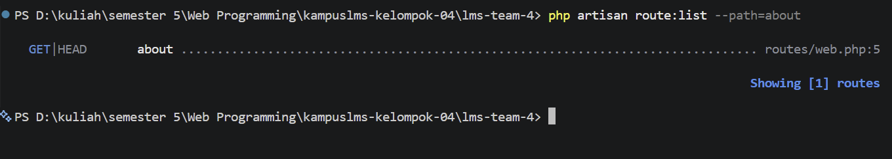

# Catatan Minggu 2
Nama : Fitriyansyah Wicaksonoaji\
Nim : 10241033\
Kelas : A

## 2.3 Read → Break → Fix → Build

### READ — Bedah instalasi Anda sendiri (45 menit)
1. Baris mana di routes/web.php yang menangkapnya?
2. Kalau ditangani controller, berkas dan method mana?
3. View mana yang dikembalikan? Di path apa persisnya?
4. Layout apa yang membungkusnya?
5. Jalankan php artisan route:list --path=tentang. Cocok dengan analisis Anda?

jawaban:

1. Baris di `routes/web.php` yang menangkap `./about` adalah bagian: 
```php
Route::get('/about', function () {
    return view('about');
});
```
2. 
3. 
4. Layout yang membungkusnya
5. 
ya, ini cocok dengan path yang berada di folder. Di mana, jalur `./about` diambil oleh `routes/web.php`

### Break - Delapan kerusakan (40 menit)
| # | Yang dirusak | Yang Anda pelajari |
|---|--------------|--------------------|
| 1 | Ubah `Route::get` menjadi `Route::post` pada route daftar mata kuliah |  |
| 2 | Ubah nama view di `return view(...)` menjadi yang tidak ada | |
| 3 | Hapus `->name('courses.show')`, lalu muat halaman yang memakai `route('courses.show')` |  |
| 4 | Pindahkan `/courses/{course}` ke ATAS `/courses/create`, lalu buka `/courses/create` |  |
| 5 | Ganti `{{ $nama }}` menjadi `{!! $nama !!}`, isi `$nama` dengan `<script>alert('XSS')</script>` |  |
| 6 | Hapus `@vite(...)` dari layout |  |
| 7 | Hentikan `npm run dev` lalu muat ulang halaman |  |
| 8 | Panggil `route('courses.show')` tanpa mengirim parameter |  |

### Checkpoint second week
1. #### Kenapa menghapus data lewat GET berbahaya? Beri satu skenario konkret.

2. #### Apa yang terjadi kalau /courses/{course} ditulis sebelum /courses/create? Kenapa?

3. #### Tunjukkan di kode Anda satu tempat yang memakai route(). Apa untungnya dibanding URL hardcode?

4. #### Apa beda {{ }} dan {!! !!}? Peragakan XSS yang Anda buat di bagian BREAK.

5. #### Apa fungsi @vite? Apa beda npm run dev dan npm run build?

6. #### Jelaskan mengapa data dari Request tidak boleh dipercaya.

