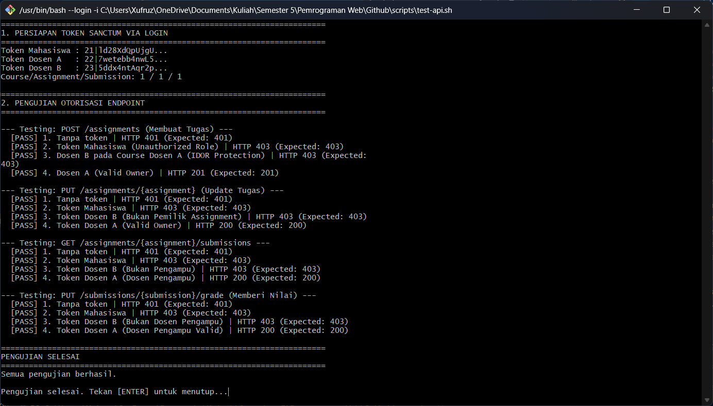

Hasil `test-api.sh`

Analisis Hasil Pengujian:
- Token Sanctum Valid: Token autentikasi untuk Mahasiswa, Dosen A, dan Dosen B berhasil dibuat dan di-parse dengan tepat.

- Autentikasi Terjaga (HTTP 401): Permintaan tanpa token di seluruh endpoint langsung ditolak oleh middleware auth:sanctum.

- Role-Based Access Control (HTTP 403): Mahasiswa yang mencoba mengakses endpoint khusus dosen (seperti membuat/mengedit tugas dan melihat/menilai submission) berhasil diblokir.

- Proteksi IDOR / Ownership Check (HTTP 403): Dosen B yang mencoba memanipulasi course/assignment milik Dosen A ditolak oleh logika otorisasi di controller.

- Akses Valid (HTTP 200/201): Dosen A sebagai pemilik sah resource berhasil melakukan aksi POST, PUT, dan GET sesuai hak aksesnya.